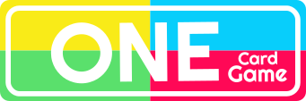

<h2 align="center"> - One Game Card -</h2>

<a href="https://gabecris.github.io/OneGame/" target="_blank">👉 Acesse a página aqui 👈</a>

## - Projeto One Game - 
 
Neste projeto, desenvolvi um jogo de cartas muito parecido com o UNO! Nele pode-se jogar quantas rodadas quiser contra um bot que joga sozinho contra você!
 
 

## - Linguagens e conceitos utilizados -

<!-- HTML -->
 

 <b> HTML 5</b>

 

• Tags semânticas

• Reutilização de classes

<!-- CSS -->
 

 <b> CSS 3</b>

• Uso de variáveis

• Reutilização de estilos

• Organização por seções

• Nomenclatura clara de classes e IDs

 

<b> JavaScript</b>
 
 

• Lógica de fazer jogada

• Criar e renderizar cartas

• Lógica de vencer uma partida

• Lógica para o bot jogar sozinho

• Lógica de comprar e passar a vez

 

 
<b> Figma</b>
 

 

• Protótipo da interface

• Desenvolvido o design e demais estilos da página

## - Meus contatos -
 

Sinta-se livre para entrar em contato comigo, seja para dar algum feedback do projeto, pedir alguma ajuda ou também apenas conversar um pouco sobre desenvolvimento e tecnologias =D

 

 
  <a href = "mailto:gabrecrisanto@gmail.com" target="_blank">
   
   
   
  

